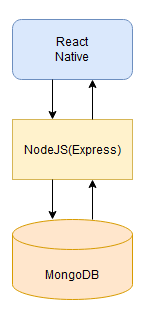

# Gecko (Team 11) - Assignment 2 group submission

## Software summary

Our partner is the Brain Injury Society of Toronto (BIST), which is an
organization that supports individuals in the City of Toronto, living with the
effects of Acquired Brain Injury (ABI), who struggle with cognitive, memory and
communication disorders that limit their ability to access resources they
require to meet their daily needs. The problem which our product is trying to
address is that many individuals from the affected population are unaware of the
supports that are available to them and have difficulty discovering them without
assistance. In addition, it can be challenging to independently manage and keep
track of such supports and other essential services, such as medical
appointments. They may also experience challenges creating transportation plans
and keeping track of information necessary for accessing these supports. As
such, many from the affected population are unable to receive the supports that
are available to them, whether it is because they are unaware of them, they have
challenges keeping track of them, they have difficulty navigating transportation
options, or they do not have the necessary information for accessing those
resources.

## How we divided the project

The team decided to divide the project into frontend, backend, and DevOps
subparts. The frontend consists of a React Native mobile app, the backend is
made up of a Node.js (Express) API and MongoDB, while DevOps takes care of the
automation and integration of the different systems we use to develop, test, and
deploy the application.

For this deliverable, the frontend exists as a standalone application which can
be run and used independently of the backend and database, and is hosted on a
remote Expo server. The backend is an API that manages interactions with the
database and grants certain administrator permissions. Further in development,
the API will be integrated with the front end to allow information to be sent
and received to the database as the end user interacts with the application.

## What each sub-team is responsible for

### Frontend

This sub-team is responsible for implementing the frontend component of the
mobile application. For this assignment, we are creating a standalone React
Native application that is not connected to any backend or database, but uses
memory to store any data which is reset upon application restart. The goal is to
illustrate our first user story which allows a user that is logged in to sign up
for events and view a list of events that they are signed up for, as well as
keep track of their own individual appointments.

### Backend

This sub is responsible for creating an API which connects to a database and
manages user accounts, creation of events and appointments, and user profile
settings. The user story we have decided to satisfy is that a user of the app
can create an account and keep track of any private appointments they wish to
enter in their calendar. In the future we will implement admin capabilities and
a portal for administrators to create public events for users to sign up for, as
well as implementing logic for the application.

### DevOps

This sub-team is responsible for our CI/CD pipeline. In this assignment we’ve
provisioned a production server that is configured to serve our Admin web app
along with our backend’s API. Our repository’s main branch will automatically be
deployed to this production server any time it’s updated. We’ve also set up a
basic test suite which will run automatically whenever a pull request is
created.
